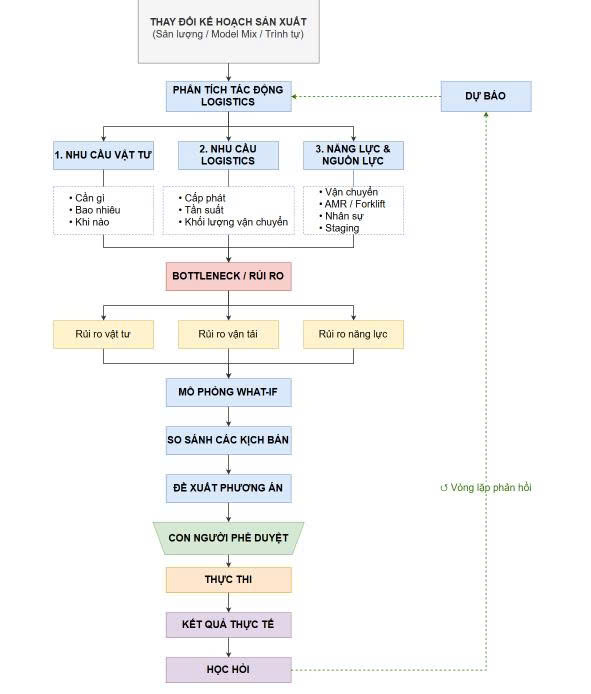
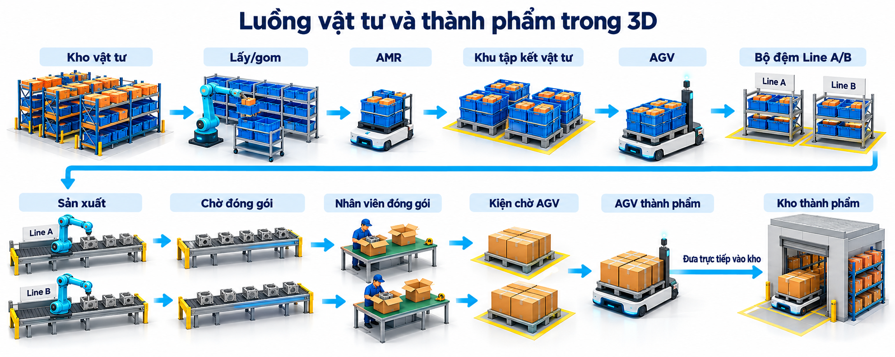

# FDX Digital Twin - DENSO Logistics Digital Twin

A 3D Digital Twin simulation for automotive component manufacturing logistics built with React, Vite, and Three.js.

## 🚀 Features
- **3D Factory & Logistics Twin**: Mô phỏng trực quan luồng cấp vật tư, các Line sản xuất, nhân viên đóng gói, hàng chờ thành phẩm và AGV đưa hàng trực tiếp vào kho thành phẩm.
- **Dynamic 3D Labels Projection**: Nhãn khu vực và Line luôn hiển thị; nhãn phương tiện và nhân viên xuất hiện khi hover.
- **What-If Scenario Simulation**: So sánh các phương án bổ sung AMR, AGV theo Line và nhân viên đóng gói, xem trước tác động và áp dụng kịch bản được chọn.
- **Rule-based Demo Recommendations**: So sánh các kịch bản theo thang điểm 0–100, điểm cao hơn tốt hơn, có xét điểm nghẽn vận chuyển và đóng gói.
- **JSON Mock Data Separation**: Dữ liệu JSON được tách thành các module trong `src/json/`.

## 🛠 Tech Stack
- **Framework**: React 19 + Vite
- **3D Engine**: Three.js
- **Styling**: CSS (TailwindCSS / Custom CSS design system)
- **Language**: TypeScript

## 📦 Getting Started

### 1. Installation
```bash
npm install
```

### 2. Development Server
```bash
npm run dev
```
Open `http://localhost:5173` in your browser.

### 3. Production Build
```bash
npm run build
```

## Luồng hoạt động thực tế


## Luồng hoạt động demo hiện tại (Chỉ là các kịch bản nạp sẵn để chứng minh tính khả thi của đề tài)

1. **Chọn tình huống và kế hoạch sản xuất.** Người dùng điều chỉnh sản lượng, Model Mix và các đầu vào liên quan. Đổi sản lượng cập nhật nhịp sản xuất và dự báo, giữ trạng thái 3D đang chạy; chuyển tình huống đặt lại mô phỏng.
2. **Tính nhu cầu và năng lực.** Chương trình tính lượng vật tư theo BOM và Model Mix, nhu cầu chuyến vận chuyển của Line A/B, năng lực AMR/AGV và năng lực nhân viên đóng gói.
3. **Theo dõi mô phỏng và điểm nghẽn.** AMR đưa vật tư từ kho tới khu tập kết; AGV cấp vào chuyền. Chuyền sản xuất khi đủ vật tư, nhân viên đóng gói thành phẩm, rồi AGV đưa hàng tới kho thành phẩm. Giao diện thể hiện thiếu vật tư, tải vận chuyển và tải đóng gói; hàng chưa đóng gói chờ trước bàn khi nhân viên xử lý không kịp.
4. **So sánh các phương án what-if.** Chương trình tạo phương án bổ sung AMR, AGV, nhân viên đúng chuyền thiếu người hoặc kết hợp các nguồn lực. Các phương án giữ nguyên sản lượng mục tiêu và được so sánh bằng năng lực, mức tải, giao trễ, điểm nguồn lực và điểm đánh giá.
5. **Xem trước phương án.** Bấm chọn một hàng trong bảng để xem ngay phương án đó trong 3D và dự báo tương ứng. Bấm **Chi tiết** để xem những thay đổi trước–sau, gồm số xe và nhân viên bổ sung theo chuyền.
6. **Chọn và áp dụng.** Người dùng xem khuyến nghị rồi bấm **Áp dụng vào mô phỏng**. Chương trình cập nhật nguồn lực và tiếp tục chạy; hàng chờ đóng gói được giữ lại để quan sát tác động của phương án.
7. **Theo dõi kết quả và lịch sử.** Người dùng quan sát sản lượng, chuyến giao, tồn vật tư và trạng thái chuyền; xem cấu hình cùng dự báo trước–sau trong lịch sử và có thể nhập mức sử dụng thực tế để đối chiếu.

Các thao tác áp dụng chỉ tác động tới mô phỏng. Demo chưa kết nối dữ liệu thiết bị nhà máy hoặc tự học từ kết quả chạy.

### Luồng vật tư và thành phẩm trong 3D



Hình minh họa các công đoạn của demo

- AMR lấy hàng từ kho và giao tới khu tập kết vật tư; AGV nhận đúng mã vật tư rồi giao vào bộ đệm của chuyền. Kho hết hàng hoặc bộ đệm đầy khiến xe chờ. Chuyền chỉ tiêu thụ vật tư và tạo sản phẩm khi đủ các vật tư cần thiết.
- Mỗi chuyền mặc định có **1 nhân viên đóng gói**, thời gian **60 giây mô phỏng/sản phẩm**, tương đương **60 sản phẩm/giờ/người**. Hàng chưa đóng gói được hiển thị trước bàn; kiện đã đóng gói nằm trên ô chờ đến khi AGV lấy.
- Với kế hoạch **120 sản phẩm/giờ** và mix mặc định **75% Line A / 25% Line B**, tải đóng gói là **150% ở A**, **50% ở B**. Thêm một nhân viên A đưa tải A xuống **75%**, năng lực lên **120 sản phẩm/giờ**.
- AGV thành phẩm đi theo tuyến hình chữ nhật. Xe giữ hàng khi qua điểm trung gian và các góc, chỉ dỡ tại ô nhận kho. Tốc độ lấy theo AGV cấp vật tư của cùng chuyền; đây là đội xe riêng, không trừ xe khỏi đội cấp vật tư.
- Nhãn khu vực chính và chuyền luôn hiện; nhãn xe và nhân viên chỉ hiện khi hover. Khu thành phẩm gồm bàn đóng gói, ô chờ AGV và kho; AGV đưa hàng trực tiếp vào kho, không qua khu tập kết trung gian.

### Xem trước, đánh giá và áp dụng what-if

- Giữ phương án **Giữ kế hoạch đang chọn** ở đầu bảng; các phương án khác xếp theo điểm đánh giá giảm dần. Các lựa chọn giữ nguyên sản lượng mục tiêu và điều chỉnh nguồn lực.
- Phương án nhân lực được tạo theo chuyền đang thiếu người, không cố định ở Line A. Số người bổ sung được tính để tải đóng gói về ngưỡng 85%; khi đã đủ người và không phát sinh tồn do thiếu nhân lực thì không tạo thêm phương án nhân lực.
- Dự báo, xem trước, NPC và thao tác áp dụng dùng chung số nhân viên. Mục Nhân sự hiển thị tổng nhân viên đóng gói A/B: mặc định 2 người, thêm một người thành 3.
- Thẻ Nhân lực đóng gói thể hiện tải, nhu cầu, năng lực và trạng thái có/không có điểm nghẽn. Hover hoặc focus biểu tượng ⓘ để xem cảnh báo cụ thể.
- Xem trước giữ bản sao trạng thái chính để có thể khôi phục khi thoát. Hàng chờ đóng gói được giữ lại khi áp dụng bổ sung nhân viên, thay vì xóa để tạo hiệu ứng hết nghẽn.
- Áp dụng ghi cấu hình và dự báo trước–sau vào lịch sử. Nguồn lực thay đổi được cập nhật trong cảnh; khi thay đội xe cấp vật tư, hàng trên xe được trả về kho trước khi tạo đội xe mới để bảo toàn vật tư.

Điểm giảm giao trễ và rủi ro được tính theo mức cải thiện so với kế hoạch hiện tại. Điểm tiết kiệm so sánh với phương án tốn nhiều điểm nguồn lực nhất trong nhóm. Điểm nguồn lực là quy ước demo, **không phải giá tiền**: mỗi xe bổ sung 12 điểm, mỗi nhân viên đóng gói bổ sung 6 điểm.

## Tài liệu bổ sung

Xem [Hướng dẫn sử dụng demo](docs/USER_GUIDE.md) để thao tác từng bước và thử các trường hợp điểm nghẽn.

Xem [Những thay đổi so với repo ban đầu](changelogs.md).


## Mã nguồn của luồng đang chạy

```text
src/main.tsx → src/app/App.tsx
                ├─ src/json/demo_config.json          Cấu hình demo
                ├─ src/services/operationsEngine.ts   Nhu cầu, năng lực, rủi ro
                ├─ src/services/packing.ts            Nhân lực và phương án đóng gói
                ├─ src/three/LogisticsFleet.ts        Xe cấp vật tư và sổ vật tư
                ├─ src/three/FactoryFloor.ts          Mặt bằng và khu tập kết
                └─ src/three/FinishedGoodsFlow.ts     Đóng gói, AGV, kho thành phẩm
```

Cảnh đang chạy dùng Three.js trực tiếp trong `App.tsx`. Các component R3F khác trong `src/three/` là bản thử nghiệm cũ, không được entry point hiện tại tải. Xem thêm `src/three/README.md`.

## Kiểm tra

```bash
npm run build
```